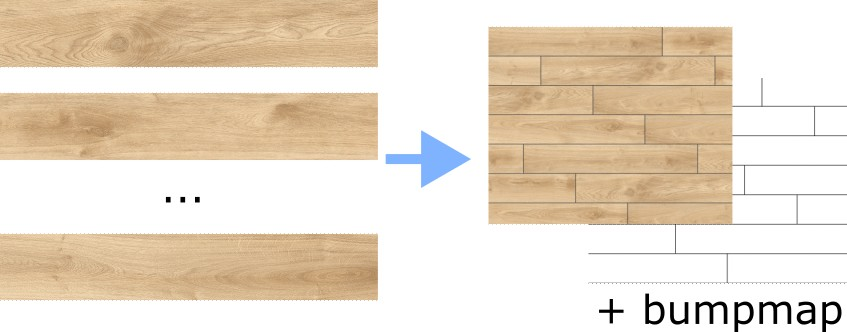

## About
This program can take a bunch of floor tiles face textures and render them into the one big floor texture with running bond pattern.

To run program you must specify a path to the configuration json file (see [Configuration.cs](Configuration.cs) file for detailed explanation what each field means).

The sample configuration file `config.json` used to generate the results like the ones located in `Samples` folder (warning -- these are really heavy images).

## How to run

1. [Install .NET 7](https://dotnet.microsoft.com/en-us/download/dotnet/7.0) (Windows, Linux, and macOS).
   For Ubuntu 22+, for example, install [Microsoft feed](https://learn.microsoft.com/en-us/dotnet/core/install/linux-ubuntu#2204-microsoft-package-feed) and just `sudo apt-get update && sudo apt-get install -y dotnet-sdk-7.0`
2. Clone the repo locally
3. Run `dotnet run config.json`

Optionally you copy and edit `config.json` to suit your needs.